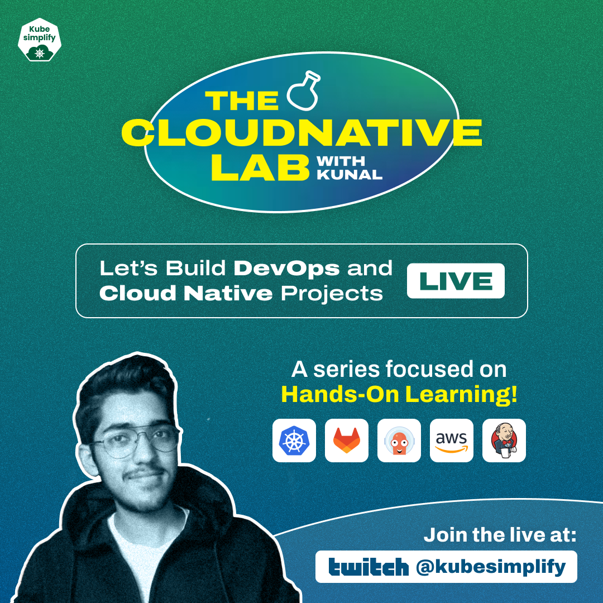

# The Cloud Native Lab 🧪

This repo is for all the **resources** & **project files** for the Cloud Native Lab series on [Twitch](https://www.twitch.tv/kubesimplify)!

## 💡 Idea 

A series of **live streams**, focused on the **"learn-by-doing"** approach where everything is focused on **hands-on learning**, such as: 
- Building DevOps/Cloudnative projects live
- Best pratices while contributing to Open Source projects
- Collaboration with industry experts
- Testing different open source tools from the ecosystem 
- **and much more . . .**

## 🤔 Where?

The [Kubesimplify Twitch channel](https://www.twitch.tv/kubesimplify).

Timings: **TBD**

## 🎙 About the Host

[Kunal Verma](https://github.com/verma-kunal) is a **DevOps and Cloud Advocate** with a passion for **Open Source**. He's been involved in the DevOps and open-source ecosystem for more than a year and has a strong experience in contributing to some major projects within the [CNCF](https://www.cncf.io/), such as **Kubernetes** and **Layer5**, **public speaking**, **community management**, and **content creation**.
