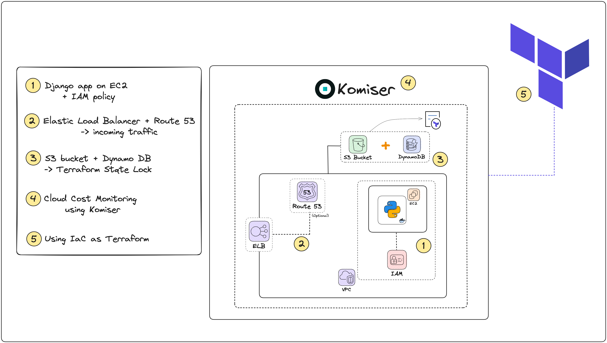

# Episode - Cloud Cost Monitoring using Komiser

## Aim
Provisioning an AWS Cloud infrastructure using Terraform to manage a simple Django application. Additionally, set up cloud costs monitoring using [Komiser](https://docs.komiser.io/)

## Technologies being used
- Django
- AWS
- Terraform
- Ansible
- Komiser (Open source tool)

## AWS Services being used
- EC2 (Elastic Compute Cloud)
- VPC (Virtual Private Cloud)
- IAM (Identity & Access Management)
- ELB (Elastic Load Balancer)
- Route 53 (DNS Service - Optional)
- S3 Bucket

## Project Diagram

## Project Breakdown/Milestones

- Milestone 1
    - [ ] Project Idea Discussion
    - [ ] Run the [Django app](https://github.com/verma-kunal/django-todo) locally
    - [ ] Build dockerfile & docker compose
    - [ ] Create IAM EC2 policy
    - [ ] Create an EC2 instance
    - [ ] Create security group for EC2 instance
    - [ ] Provision the instance + SSH

## Resources

- [Tailwarden Blog](https://www.tailwarden.com/blog/monitoring-cloud-costs-and-usage-of-a-next-js-application-with-komiser)